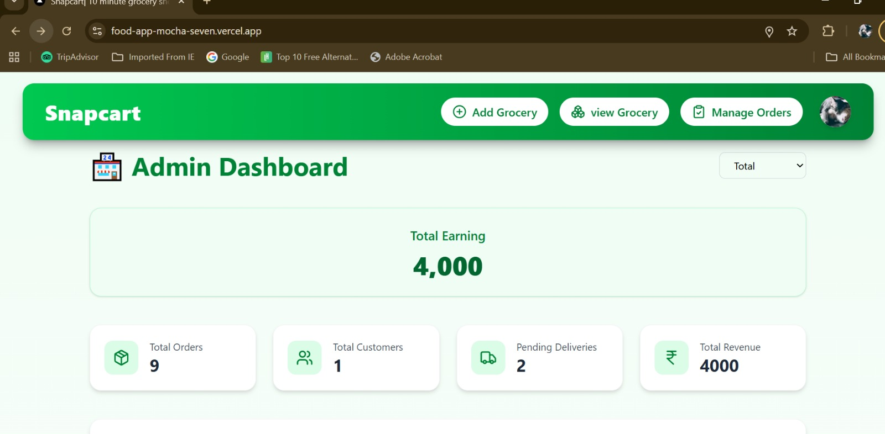
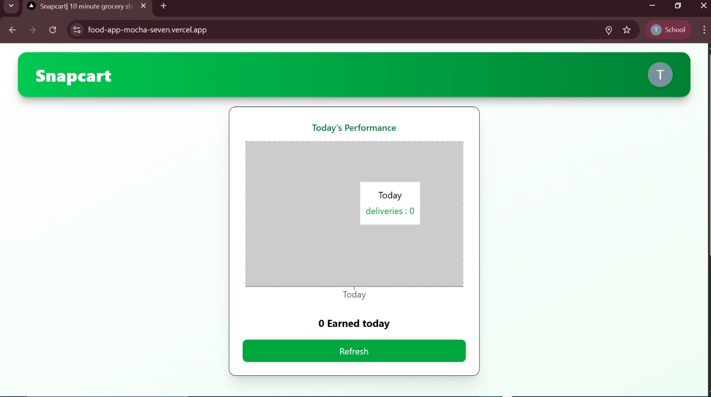
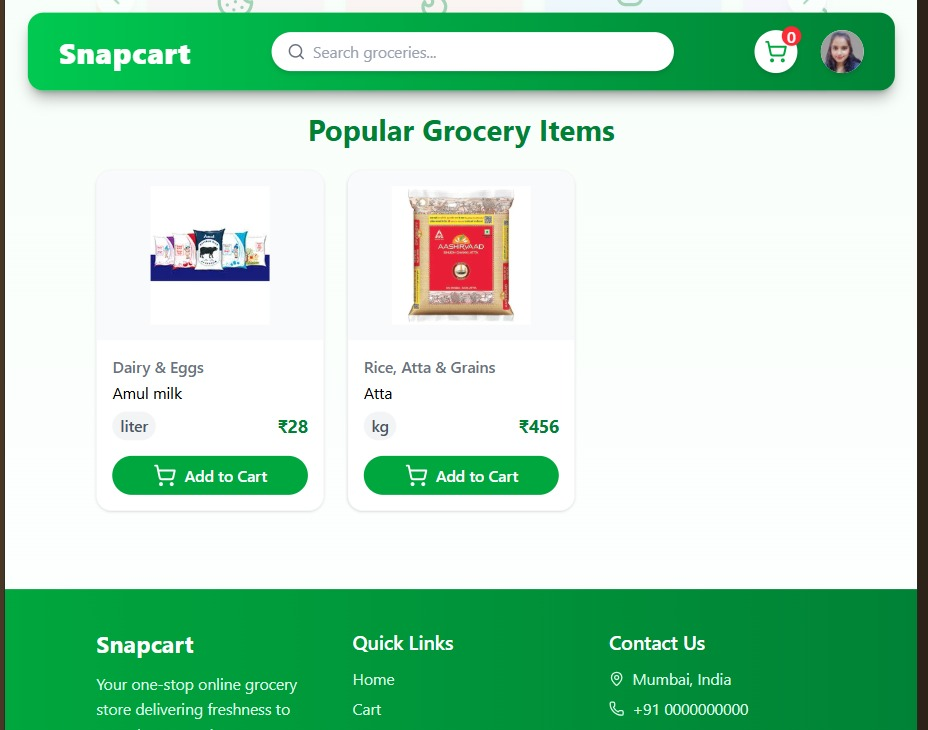
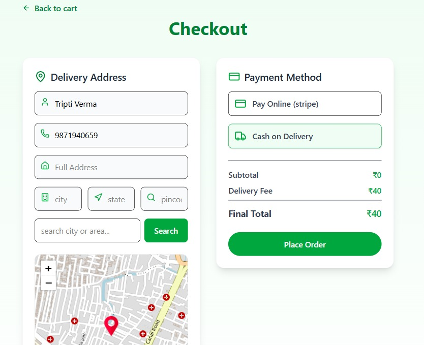

# 🛒 AI Powered 10-Minute Grocery Delivery App (Snapcart)

Snapcart is a **full-stack, AI-powered grocery delivery web application** designed to deliver groceries within **10 minutes**.  
The platform integrates **Artificial Intelligence**, **online payments**, and **role-based dashboards** to provide a real-world e-commerce experience.

---

## 🚀 Live Demo
🔗 https://food-app-mocha-seven.vercel.app

---

## 🤖 AI Features

Snapcart includes AI to enhance user and delivery experience:

- 🧠 **AI Chat Assistant**
  - Handles order-related queries
  - Helps customers and delivery partners with real-time responses
- 📦 **Smart Order Communication**
  - AI understands user messages
  - Improves delivery coordination
- 🚚 **Delivery Assistance**
  - AI-assisted chat for delivery partners
  - Faster issue resolution

---

## 📸 Screenshots

### 🧑‍💼 Admin Dashboard

**Features:**
- Total earnings & revenue tracking
- Total orders & customers
- Pending deliveries overview
- Add, view & manage grocery items
- Order management panel

---

### 🚚 Delivery Partner – Daily Performance

**Features:**
- Today's deliveries count
- Daily earnings tracking
- Performance chart
- Refresh earnings button
- Clear inactive delivery state

---

### 🛍️ Customer – Grocery Listing Page

**Features:**
- Search groceries
- Category-based products
- Price per unit (kg / liter)
- Add to cart
- User profile & cart indicator

---

### 💳 Checkout & Payment Page

**Features:**
- Delivery address input
- Map-based location selection
- Payment options:
  - Stripe Online Payment
  - Cash on Delivery
- Order summary & final total
- Place order functionality

---

## ✨ Core Features

- ⚡ 10-minute grocery delivery concept
- 🤖 AI-powered chat & order assistance
- 🔐 Secure Stripe payment integration
- 👤 Role-based dashboards:
  - Admin
  - Customer
  - Delivery Partner
- 📦 Order & delivery management
- 📊 Earnings and performance analytics
- 📱 Fully responsive UI

---

## 🧰 Tech Stack

### Frontend
- Next.js / React
- Tailwind CSS
- Context API / Redux

### Backend
- Node.js
- API Routes / Express
- Socket.IO (real-time communication)

### Database
- MongoDB

### AI & Integrations
- AI API (LLM-based assistant)
- Stripe Payment Gateway
- Google OAuth Authentication

### Deployment
- Vercel

---

## ⭐ Why This Project Stands Out

- Combines **E-commerce + AI + Real-time systems**
- Uses real payment gateway (Stripe)
- AI reduces manual customer support
- Scalable, production-ready architecture
- Ideal for interviews & portfolio projects

---

## 🔮 Future Enhancements

- AI-based product recommendations
- Demand prediction using AI
- Live delivery tracking with maps
- Voice-based grocery ordering
- Mobile application

---

## 👩‍💻 Author

**Tripti Verma**  
Full-Stack Developer  
GitHub: https://github.com/Triptiverma003

---

## 📄 License
This project is for educational and portfolio purposes.

